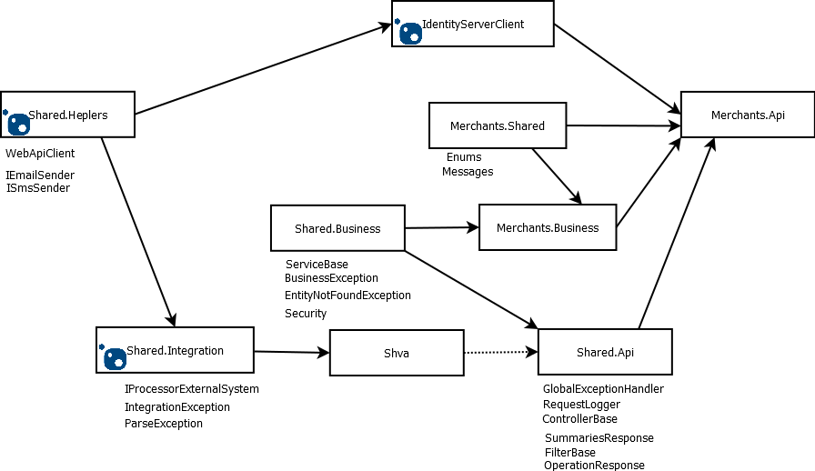

# EasyCard coding guideline

## Git convention

1. Please use task number and colon at the beginning of commit comment. For example:

        ECNG-23: Shva integration draft

2. Preferred to use feature branches for functionality area implementation. For example:

        feature/ShvaIntegration

3. Each commit should contain only logical related set of changes if possible. Even if you are working with one task, it have sense to split changes to several commits in case of large amount of changes.

## Code style

Projects used Stylecop code style analyzers. Please follow refactoring suggestions ("show potential fixes" context menu in Visual Studio). _Note: build should not contain any warnings!_ (at least projects which you working on). Please take into account, that in nearest future all workings will be converted to errors.

For example, you should wrap `if` statement should be wrapped by braces. For example

            if (src == null)
                throw new EntityNotFoundException(...);

should be

            if (src == null)
            {
                throw new EntityNotFoundException(...);
            }

Please care about spaces in formatting etc. You can use Visual Studio extension [Format All Files](https://marketplace.visualstudio.com/items?itemName=munyabe.FormatAllFiles).

It is very important to keep code clean, especially for cases like merge or automated Roslyn-based refactoring.

Try to use latest C# features, including pattern matching (use Visual Studio suggestions)

## Project structure

1. Dependencies structure - integration projects. Api projects should know only integration contracts from Shared.Integration - do not add reference on integration projects (like Shva, ClearingHouse etc,) directly to Api and Business projects.

2. Use existing helpers. Add new helpers if needed to existing helpers libraries

## Entity framework convention

1. Please contact to other developers before adding migrations or updating databases on QA environment - _it is not possible to merge migrations_

2. Preferred not to use collections properties. In case if you decided to use collection, please ensure that generated query does not load extra data. You can use [\EasyCard\Shared.Business\Extensions\IQueryableExtensions.cs](../EasyCard/Shared.Business/Extensions/IQueryableExtensions.cs) to view SQL generated by EntityFramework (to be used only on development stage).

3. Use security filters for each queryable

4. Use `AsNoTracking()` for all queries

## Documentation

1. For the moment documentation headers validation for classes and class members are disabled, but it will be re-enabled in nearest future to keep public Apis clean. So please care about documentation if possible.

## Localization

1. User resource files for localization

## Testing

TBC

